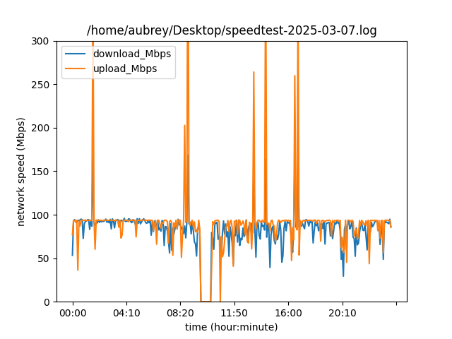

# speedtest

This [Jupyter notebook](speedtest.ipynb) in this repository analyzes Ookla speedtest data saved in a log file which is built by automatically by a cron job which runs once every five minutes.

The code runs on an Ubuntu machine on which the Ookla speedtest command line interface has been installed. 
```
sudo apt install speedtest-cli
```
### Example output

